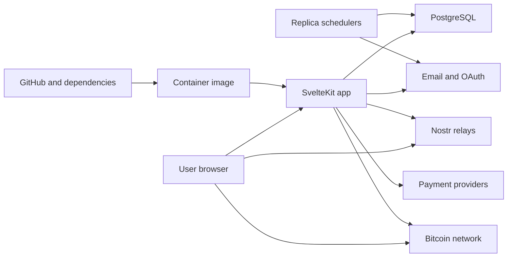

# KeyFate AppSec threat model

## Executive summary
At HEAD `b7b7aef1a897c418e0402acd211fecf0206d8217`, KeyFate is an Internet-facing SvelteKit service whose highest risks are custody concentration and unsafe recovery automation. Any authenticated user can submit arbitrary AES-GCM ciphertext to the server’s production encryption key through a global decrypt oracle; the same server key decrypts every stored server-side Shamir share. NIP-59 recovery decrypts but does not verify event signatures or bind the inner rumor to an expected sender. Finally, the in-process scheduler is only replica-local: rolling/multi-replica execution is expected, while crash recovery for a secret left `triggered` is not evident. These are launch-relevant because both Nostr and Bitcoin recovery are required.

## Scope and assumptions
- **In scope:** canonical application and deployment configuration under `frontend/src`, `frontend/Dockerfile`, `frontend/migrate-and-start.sh`, and `.github/workflows/ci.yml` at the confirmed HEAD.
- **Out of scope:** `.worktrees`, dependencies/vendor, generated output, tests as runtime evidence, plans, and prior audit artifacts. Tests were consulted only as validation context, not as production controls.
- Production is Internet-facing on Railway; rolling deployment/multi-replica overlap is a confirmed requirement.
- Nostr and Bitcoin recovery are required launch scope. PostgreSQL, email, OAuth, Stripe/BTCPay, public Nostr relays, and Bitcoin APIs/network are external trust domains.
- Railway release gating is absent or unknown. Repository CI builds on pushes and PRs, but no deploy/release gate is represented (`.github/workflows/ci.yml:3-13,55-80`).
- **Open questions:** whether Railway requires successful GitHub checks before deploy; whether CSP is injected outside this repository; whether old `triggered` jobs are operationally repaired. These materially affect supply-chain, browser-key, and availability rankings.

## System model
### Primary components
- Browser Svelte UI performs share creation/recovery and retains recovery material in Web Storage (`frontend/src/lib/components/ExportRecoveryKitButton.svelte:65-76,100-125`).
- SvelteKit/Auth.js API authenticates users with Google, password, or OTP and uses 24-hour JWT sessions (`frontend/src/auth.ts:19-47,100-185`).
- PostgreSQL stores identities, billing state, encrypted server shares, schedules, recipients, and disclosure logs (`frontend/src/routes/api/secrets/+server.ts:141-181`).
- Server crypto uses one environment-backed AES-256-GCM key version for application encryption/decryption (`frontend/src/lib/encryption.ts:41-68,85-138`).
- In-process cron performs reminders, disclosure, exports, deletion, token cleanup, and Bitcoin confirmation (`frontend/src/lib/cron/scheduler.ts:15-81,109-129`).
- Runtime integrates with email, Stripe/BTCPay, Nostr relays, Bitcoin services, and Google OAuth. CI/build is separate and produces a non-root Bun container (`frontend/Dockerfile:14-45`).

### Data flows and trust boundaries
- **Internet/browser → SvelteKit:** sessions, OTP/password/OAuth, CSRF tokens, secret shares, recipient data, recovery requests; HTTPS redirect and headers exist, auth/ownership is route-specific (`frontend/src/hooks.server.ts:15-23,29-86`). No repository CSP is set.
- **SvelteKit → PostgreSQL:** PII, tokens, schedules, encrypted shares, disclosure state over the database driver; app authorization and transactions are the guarantees. Server ciphertext and its decryption key remain in the same service trust domain.
- **Browser → Web Storage/downloads:** user-managed shares, Nostr event IDs, plaintext symmetric keys K, passphrase bundles, and recovery kits; browser-origin integrity and endpoint security are the effective controls (`frontend/src/lib/components/ExportRecoveryKitButton.svelte:100-125,141-174`).
- **SvelteKit/browser ↔ Nostr relays:** signed gift wraps and untrusted relay events over WSS; publishing signs seal/wrap, but recovery only checks kinds and decryptability (`frontend/src/lib/nostr/gift-wrap.ts:67-114`; `frontend/src/lib/crypto/recovery-flows.ts:110-142`).
- **Browser/server ↔ Bitcoin ecosystem:** transaction/UTXO data and OP_RETURN recovery material; parser requires OP_RETURN structure, but recovered data must be tied to the intended kit/transaction (`frontend/src/lib/crypto/recovery-flows.ts:145-175`).
- **SvelteKit ↔ payment/email/OAuth providers:** account metadata, checkout state, messages, and OAuth assertions over provider SDK/HTTPS. Webhooks are public entry points.
- **Scheduler replicas → PostgreSQL/providers:** deadline state and irreversible disclosures. A conditional status update arbitrates secret acquisition, but the scheduler’s running set is process-local (`frontend/src/lib/cron/process-reminders.ts:102-121`; `frontend/src/lib/cron/scheduler.ts:9,85-104`).
- **GitHub/dependencies/base images → production image/Railway:** source, actions, latest Bun toolchain, packages, and mutable image tags. CI validates build but repository evidence does not connect CI success to Railway release (`.github/workflows/ci.yml:24-31,43-53,60-80`; `frontend/Dockerfile:2,8,15`).

#### Diagram


## Assets and security objectives
| Asset | Why it matters | Security objective |
|---|---|---|
| Server AES key and encrypted server shares | A threshold share may unlock high-value secrets; common-key compromise affects all tenants | C/I |
| Browser-held shares, plaintext K, nsec/passphrases, recovery kits | Can enable recovery or permanently compromise users’ secrets | C/I/A |
| Nostr event authenticity and availability | False or missing shares corrupt/deny required recovery | I/A |
| Bitcoin timelock transactions and OP_RETURN binding | Required autonomous recovery path; tampering can redirect or defeat recovery | I/A |
| User identities, JWTs, OTPs, OAuth state | Control access to custody and billing operations | C/I |
| Deadlines, processing state, disclosure logs | Prevent premature, duplicate, or missed irreversible disclosure | I/A |
| Recipient PII and audit/export data | Sensitive personal and operational data | C/I |
| Payment/subscription state and provider credentials | Controls entitlement and financial operations | C/I |
| Source, lockfile, CI workflow, container image | Production code integrity | I |

## Attacker model
### Capabilities
- Anonymous remote attacker can exercise public auth, recovery, checkout, health, webhook, and cron URLs; operate malicious Nostr relays/events; and submit malformed/high-volume inputs.
- A normal authenticated tenant can invoke authenticated APIs, including `/api/decrypt`, and obtain chosen ciphertext from their own records or other exposure.
- An attacker may steal a session, exploit same-origin script execution/extension compromise, compromise a recipient mailbox, or control a dependency/provider account; these are conditional but realistic.
- Multi-replica overlap, restart, and mid-job crash are normal operational fault/attack amplifiers rather than attacker prerequisites.

### Non-capabilities
- No assumed Railway/PostgreSQL host access, `AUTH_SECRET`, `ENCRYPTION_KEY`, `CRON_SECRET`, Nostr server key, provider secrets, or victim nsec/passphrase.
- No assumed break of AES-GCM, ChaCha20-Poly1305, secp256k1, Shamir sharing, TLS, or Bitcoin consensus.
- Nostr relay control alone does not reveal NIP-44 plaintext; Bitcoin observation alone does not reveal data before it is published.

## Entry points and attack surfaces
| Surface | How reached | Trust boundary | Notes | Evidence |
|---|---|---|---|---|
| Auth/OTP/OAuth | Public HTTP/Auth.js | Internet → app/DB/provider | OTP creates users; DB lockouts are global per email | `frontend/src/auth.ts:93-147`; `frontend/src/lib/auth/otp.ts:120-248` |
| Global decrypt | Authenticated POST | Tenant → global server key | No ownership/ciphertext provenance or size schema | `frontend/src/routes/api/decrypt/+server.ts:12-28` |
| Secret/reveal APIs | Authenticated HTTP | Browser → app/DB | Reveal route has CSRF, recent auth, ownership | `frontend/src/routes/api/secrets/[id]/reveal-server-share/+server.ts:18-70` |
| Recovery page | Public browser UI | Relay/Bitcoin/file → browser | Handles nsec, passphrase, ciphertext, raw transactions | `frontend/src/lib/crypto/recovery-flows.ts:98-175` |
| Checkout GET/POST | Authenticated HTTP | Browser → app/payment | GET creates state without CSRF; POST has CSRF | `frontend/src/routes/api/create-checkout-session/+server.ts:9-40,47-126` |
| Cron APIs/scheduler | Signed/bearer HTTP and in-process timers | replicas → DB/providers | HMAC has five-minute window; bearer fallback | `frontend/src/lib/cron/utils.ts:31-114`; `frontend/src/lib/cron/scheduler.ts:109-129` |
| Webhooks | Public provider callbacks | providers → app/DB | Stripe and BTCPay routes require focused signature/replay review | `frontend/src/routes/api/webhooks/stripe/+server.ts`; `frontend/src/routes/api/webhooks/btcpay/+server.ts` |
| CI/container startup | GitHub/Railway | developer/supply chain → runtime | mutable toolchain/images; migrations run in every starting replica | `.github/workflows/ci.yml:24-80`; `frontend/migrate-and-start.sh:12-30` |

## Top abuse paths
1. Authenticated attacker submits captured application ciphertext, IV, and tag to `/api/decrypt`; the shared production key decrypts it without checking tenant or record provenance; plaintext is returned.
2. Attacker who gains the server key/runtime environment combines it with the database dump, decrypts every server share, and targets externally leaked/user shares to cross thresholds.
3. Malicious relay supplies a decryptable, structurally plausible gift wrap/seal/rumor; recovery accepts fields without signature, event-hash, sender, recipient-tag, or payload-schema verification; victim combines attacker-selected shares or is denied recovery.
4. XSS, compromised same-origin dependency, or hostile browser extension reads `localStorage` plaintext Ks and user shares, then captures an exported kit/server share to satisfy a recovery threshold.
5. Attacker repeatedly submits invalid OTPs for a victim email; DB counters escalate to permanent lockout, denying account access even though brute-force resistance is achieved.
6. A scheduler replica marks a secret `triggered`, then crashes before completion; other workers cannot acquire the `active`-only lock and no lease/reaper is evident, causing permanent non-disclosure. Concurrent replicas may also duplicate non-secret job side effects because only process-local running sets exist.
7. Cross-site navigation or an embedded link triggers authenticated checkout GET, creating customers/sessions and external side effects without CSRF protection; abuse causes nuisance/cost/state confusion, not direct charge absent provider confirmation.
8. Compromised GitHub Action/toolchain/package/base-image update reaches a Railway auto-deploy because actions use major tags, Bun/image tags are mutable, and release gating is unknown; attacker gains runtime secrets and custody data.

## Threat model table
| Threat ID | Threat source | Prerequisites | Threat action | Impact | Impacted assets | Existing controls (evidence) | Gaps | Recommended mitigations | Detection ideas | Likelihood | Impact severity | Priority |
|---|---|---|---|---|---|---|---|---|---|---|---|---|
| TM-001 | Authenticated tenant/session thief | Any account and valid AES-GCM tuple encrypted under the app key | Use global chosen-ciphertext decrypt endpoint | Cross-tenant share/plaintext disclosure | AES key domain, server shares | Session required; AEAD tag checked (`routes/api/decrypt/+server.ts:14-28`; `lib/encryption.ts:130-136`) | No record ownership/provenance, version binding, schema/size limit | **Remove in production.** Replace with ID-scoped owner/re-auth endpoint that loads ciphertext server-side; separate purpose/tenant keys or AEAD AAD. If legacy-required, feature-gate and rate-limit | Alert on all calls, distinct secret IDs, failures, volume | High: endpoint is explicit and any user can register | High: compromises any obtainable ciphertext | **critical** |
| TM-002 | Runtime/operator/supply-chain compromise | App env/key plus DB access, or oracle plus ciphertext acquisition | Decrypt common-key server custody at scale | Mass threshold-share exposure | All tenants’ server shares | AES-256-GCM; 32-byte/entropy checks (`lib/encryption.ts:41-68,85-138`) | One global key; server decrypts shares for disclosure; optional client-supplied ciphertext accepted (`routes/api/secrets/+server.ts:141-157`) | Conditionally use envelope encryption with KMS/HSM, per-record DEKs and AAD; prohibit client-supplied server ciphertext; rotate/version keys; minimize server custody or redesign threshold so server breach cannot combine known recovery material | KMS decrypt audit, bulk DB-read alerts, key-use baselines | Medium: requires privileged compromise | High: systemic confidentiality failure | **high** |
| TM-003 | Malicious relay/event publisher | Victim processes attacker-controlled relay event; attacker can form decryptable NIP-44 material to victim | Forge/substitute recovery payload | Wrong-share injection, recovery DoS, possible unsafe reconstruction decisions | Nostr recovery integrity | Publishing signs seal/wrap (`lib/nostr/gift-wrap.ts:75-114`); recovery checks kinds (`lib/crypto/recovery-flows.ts:114-130`) | No signature/hash verification, trusted sender binding, `p`-tag check, rumor ID recomputation, or payload schema/bounds | Verify outer and seal signatures/event IDs, recipient tag, rumor hash, expected server pubkey and kit-bound secret/event IDs; strict schema and duplicate share-index rejection | Record verification failures by relay/event ID without key material | High: relays/events are untrusted and path is public | High: required recovery integrity/availability | **critical** |
| TM-004 | XSS/dependency/extension/local attacker | Script execution in KeyFate origin or browser profile access | Exfiltrate shares, plaintext K, nsec/passphrase, downloaded kit | Secret recovery or permanent loss | Browser recovery material | Frame denial, nosniff, permissions policy (`hooks.server.ts:72-83`); UI claims local processing | Sensitive plaintext in localStorage; no repository CSP; downloads contain server share and K material (`ExportRecoveryKitButton.svelte:100-167`) | Keep Ks/shares in memory or encrypted IndexedDB with short expiry; never persist nsec; deploy nonce/hash-based CSP and Trusted Types where feasible; explicit kit encryption and OS-keystore guidance | CSP reports, integrity telemetry that never logs keys, storage-age cleanup metrics | Medium: requires client compromise | High: threshold material is directly actionable | **high** |
| TM-005 | Remote unauthenticated attacker | Knows victim email | Submit invalid OTP attempts until escalating lockout | Targeted/permanent account DoS | Account availability | Transactional token locking and attempt limits (`lib/auth/otp.ts:126-248`) | Attacker-controlled failures permanently lock victim at 20 attempts (`lib/auth/otp.ts:251-306`) | Remove automatic permanent lockout; use timed exponential throttling by account+IP/device, CAPTCHA/risk checks, support recovery; ensure atomic upsert under concurrency | Alert on distributed attempts and lockout spikes; notify victim securely | High: email addresses are discoverable | Medium: recoverable denial, but dead-man-switch access is sensitive | **high** |
| TM-006 | Fault, malicious load, overlapping replicas | Crash after state transition or concurrent schedules | Strand `triggered` secret or duplicate side effects | Missed/premature/duplicate irreversible disclosure | Schedule and disclosure availability/integrity | Atomic `active`→`triggered` acquisition; per-recipient sent-log check (`process-reminders.ts:102-121,206-217`) | No lease expiry/reaper shown; process-local running set; unhandled rejection does not exit (`scheduler.ts:9,85-104`; `hooks.server.ts:92-103`) | Add DB leases with owner/expiry/heartbeat, idempotency keys/outbox, `SKIP LOCKED`, startup/periodic stale-job recovery; make every job replica-safe; exit on unhandled rejection; run migrations once or prove advisory locking | Alert on stale `processingStartedAt`, duplicate sends, scheduler heartbeat gaps, replica/job ownership | High: rolling overlap/crash is confirmed | High: core safety/liveness failure | **critical** |
| TM-007 | Cross-site attacker | Victim authenticated; link/navigation accepted | Trigger checkout GET repeatedly | Provider resource abuse and confused billing flow | Payment state, availability | Session required; lookup key allowlisted against provider prices (`create-checkout-session/+server.ts:55-83`) | GET mutates external state and lacks CSRF (`:9-23`), unlike protected POST (`:32-40`) | Make GET render/redirect to an inert confirmation or one-time signed intent; create checkout only by CSRF-protected POST; idempotency key customer/session creation | Rate-limit and alert on session/customer creation without completion | Medium | Medium | **medium** |
| TM-008 | Supply-chain/developer account attacker | Compromise action/tag/dependency/base image or merge path | Inject code into production artifact | Runtime-secret theft and custody compromise | Image, secrets, DB, all user assets | Frozen lockfile, tests/typecheck/build, non-root runtime (`ci.yml:20-80`; `Dockerfile:19-39`) | `bun-version: latest`; mutable `oven/bun:1`; actions not SHA-pinned; no provenance/SBOM/signing; Railway release gate absent/unknown | If Railway auto-deploys, require protected environment and successful required checks; pin action SHAs/toolchain/image digests; generate/verify SBOM and signed provenance; separate deploy credentials | Alert on deploy without approved commit/checks, digest drift, provenance failure | Medium: depends on unknown release policy | High: full production compromise | **high (conditional)** |

## Criticality calibration
- **Critical:** realistic path to systemic secret/share disclosure or failure of required irreversible recovery. Examples: global decrypt oracle; unsigned NIP-59 recovery acceptance; stranded disclosures under expected replica overlap.
- **High:** privileged compromise causes mass custody loss, client compromise exposes threshold material, targeted authentication denial, or untrusted production artifact deployment. Examples: common server key; browser plaintext K; supply-chain compromise.
- **Medium:** bounded financial/operational abuse without direct secret access. Examples: checkout GET CSRF/resource creation; noisy targeted provider/API DoS with recovery.
- **Low:** low-sensitivity metadata leakage or easily rate-limited nuisance with no custody, recovery, identity, or financial effect. Examples: public configuration enumeration; verbose but non-secret health metadata.

Rankings depend most on the confirmed replica overlap, launch-critical recovery paths, whether Railway auto-deploy is gated, whether CSP exists externally, and availability of operational stale-job repair.

## Focus paths for security review
| Path | Why it matters | Related Threat IDs |
|---|---|---|
| `frontend/src/routes/api/decrypt/+server.ts` | Global production-key decryption surface | TM-001 |
| `frontend/src/lib/encryption.ts` | Common key domain and crypto API | TM-001, TM-002 |
| `frontend/src/routes/api/secrets/+server.ts` | Custody ingestion and optional supplied ciphertext | TM-002 |
| `frontend/src/lib/crypto/recovery-flows.ts` | NIP-59 authenticity and Bitcoin parsing/binding | TM-003 |
| `frontend/src/lib/nostr/gift-wrap.ts` | Sender/signature construction assumptions | TM-003 |
| `frontend/src/lib/components/ExportRecoveryKitButton.svelte` | Browser storage/export of threshold material | TM-004 |
| `frontend/src/lib/auth/otp.ts` | Brute-force controls create account DoS | TM-005 |
| `frontend/src/lib/cron/process-reminders.ts` | Irreversible disclosure locking/idempotency | TM-006 |
| `frontend/src/lib/cron/scheduler.ts` | Replica-local concurrency and failure behavior | TM-006 |
| `frontend/src/routes/api/create-checkout-session/+server.ts` | State-changing GET | TM-007 |
| `.github/workflows/ci.yml` | CI trust and absent release representation | TM-008 |
| `frontend/Dockerfile` | Mutable build/runtime bases and privilege control | TM-008 |

## Quality check
- Covered discovered route classes: auth, secrets/custody, public recovery, checkout/webhooks, cron/health, exports/admin; route-specific manual review remains warranted for all handlers.
- Each concrete runtime boundary is represented in at least one threat; Bitcoin is included as required scope, but no independent critical Bitcoin exploit is asserted from available evidence.
- Runtime findings are separated from CI/build/deployment findings.
- Confirmed user context (multi-replica overlap, both recovery paths, unknown release gate) is reflected.
- Controls are distinguished from gaps; external CSP/release/recovery operations remain explicit unknowns.

```acceptance-report
{
  "criteriaSatisfied": [
    {
      "id": "criterion-1",
      "status": "satisfied",
      "evidence": "Created only the requested threat-model artifact for canonical app/config at verified HEAD b7b7aef1; no project/source files were modified."
    },
    {
      "id": "criterion-2",
      "status": "satisfied",
      "evidence": "Report provides file:line evidence, system boundaries, assets, attacker model, entry points, eight prioritized abuse paths/threats, controls, conditional mitigations, focus paths, and validation notes."
    }
  ],
  "changedFiles": [
    ".pi-subagents/artifacts/outputs/06a04a4e-9f3f-490c-b36b-3f46eab1d9e5/audit-threat/keyfate-threat-model.md"
  ],
  "testsAddedOrUpdated": [],
  "commandsRun": [
    {
      "command": "git rev-parse HEAD",
      "result": "passed",
      "summary": "Verified HEAD b7b7aef1a897c418e0402acd211fecf0206d8217."
    },
    {
      "command": "Repository rg/find/nl inspection of canonical frontend routes, crypto, auth, scheduler, CI and container configuration",
      "result": "passed",
      "summary": "Collected line-addressable runtime and CI/deployment evidence while excluding worktrees, vendor, generated files, and audit artifacts."
    },
    {
      "command": "git status --short; git diff --stat",
      "result": "passed",
      "summary": "Observed no staged files and no tracked source diff; pre-existing untracked files/directories were present, including .pi-subagents/."
    }
  ],
  "validationOutput": [
    "Threat-model quality check confirms entry-point classes, trust boundaries, runtime/CI separation, user clarifications, assumptions, and open questions are covered.",
    "No executable tests were run because this is a review-only documentation artifact and source files were not changed."
  ],
  "residualRisks": [
    "Railway release gating remains unknown, so TM-008 is conditional.",
    "External CSP and operational stale-job recovery could not be established from canonical repository evidence.",
    "A full route-by-route code audit and live multi-replica failure exercise were outside this threat-model scope."
  ],
  "noStagedFiles": true,
  "diffSummary": "Added one repository-grounded Markdown AppSec threat model artifact; no application/config changes.",
  "reviewFindings": [
    "blocker: frontend/src/routes/api/decrypt/+server.ts:12 - authenticated global decrypt oracle accepts arbitrary ciphertext under the shared server key",
    "blocker: frontend/src/lib/crypto/recovery-flows.ts:110 - NIP-59 recovery decrypts but does not verify signatures, hashes, recipient binding, or trusted sender",
    "blocker: frontend/src/lib/cron/process-reminders.ts:102 - active-to-triggered lock has no evidenced lease/reaper for crash recovery under required multi-replica operation"
  ],
  "manualNotes": "Independent reviewer gate remains required. Pre-existing untracked repository items were not modified or staged."
}
```
