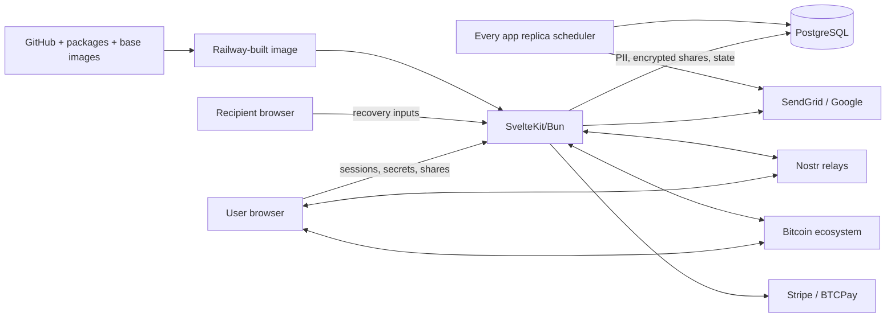
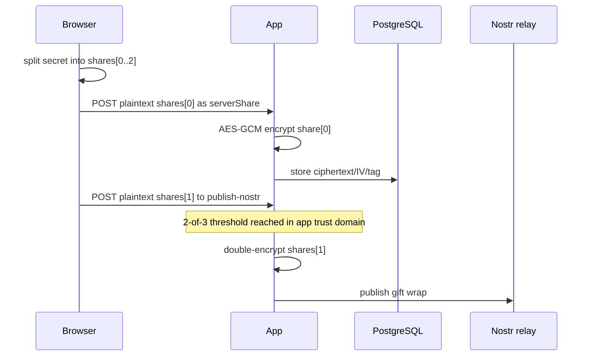
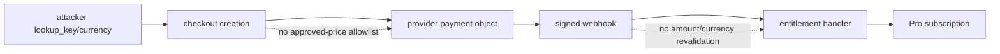
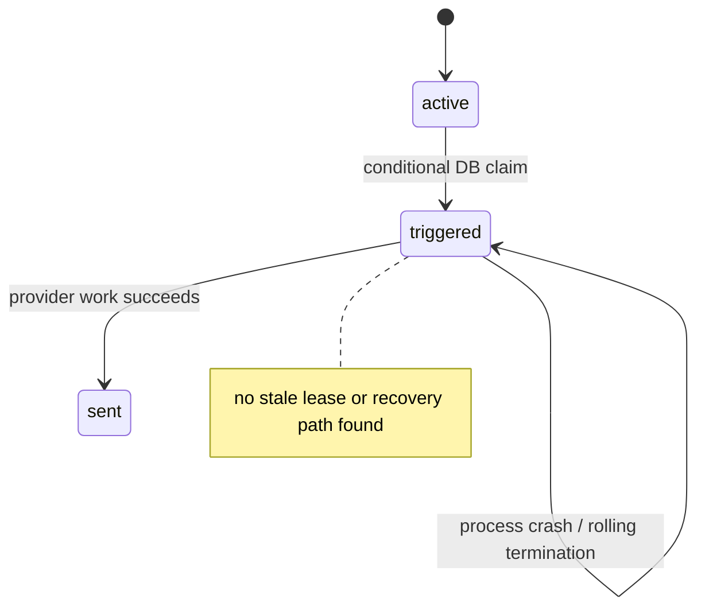

# KeyFate security knowledge base

Audit ID: `2026-07-10T23:21:09Z`  
Repository: `Aviat-IO/KeyFate`  
Canonical commit: `b7b7aef1a897c418e0402acd211fecf0206d8217`  
Scope: tracked canonical repository only; `.worktrees`, dependencies, generated/build output, and vendor files excluded from source review.

## Executive risk model

KeyFate is a high-consequence, multi-tenant dead-man-switch application. Its defining safety properties are stronger than ordinary SaaS properties:

1. the application trust domain must not reach the Shamir reconstruction threshold;
2. a deadline disclosure must occur exactly once despite crashes, restarts, and overlapping replicas;
3. recovery inputs from Nostr/Bitcoin must be authenticated and usable by the intended recipient;
4. billing events must not grant entitlement without validating the paid product;
5. a read-only data compromise must not become a plaintext-recovery oracle.

At the audited commit, properties 1–5 are not all satisfied. The highest launch risk is not conventional injection: it is failure of cryptographic custody and crash-safe disclosure semantics.

## Project Classification and System Model

- SvelteKit 5 / Svelte 5 web application running on Bun.
- Auth.js v5 authentication: Google OAuth, password credentials, and email OTP; JWT sessions.
- PostgreSQL via Drizzle ORM; 30 `pgTable` definitions.
- In-process `node-cron` scheduler handles reminders, disclosure, exports, deletion, token cleanup, and Bitcoin confirmation.
- Browser performs Shamir splitting and recovery operations.
- Server uses one environment-backed AES-256-GCM application key version for stored server shares.
- External systems: Google OAuth, SendGrid, Stripe, BTCPay Server, Cloudflare Turnstile, Nostr relays, Bitcoin data providers, CoinGecko, PostgreSQL, Railway.
- Container is a multi-stage Bun image and runs as a non-root UID.

## Threat Model

The threat model treats application-process compromise, read-only database compromise, malicious protocol peers, low-privilege tenants, and normal replica failure as distinct attacker/fault positions. It does not assume cryptographic primitive breaks or production credential possession.

## Assets and security invariants

| Asset | Required invariant | Observed concern |
|---|---|---|
| Original secret plaintext | Never reconstructable by the service | Normal 2-of-3 Nostr setup sends two distinct plaintext shares through the server |
| Server Shamir share | Ciphertext compromise must not yield plaintext | Generic authenticated decrypt route and plaintext DB bearer-token path expose decryption |
| Recipient shares / K / Bitcoin keys | Browser-only and recipient-controlled | Stored in script-readable Web Storage; Bitcoin recipient key is never delivered |
| Disclosure schedule | Crash-safe, durable, exactly once | `active`→`triggered` claim can be stranded permanently after crash |
| Nostr recovery event | Authentic, bound to recipient and expected author | Seal/rumor/trusted-author checks absent; publisher/UI payloads incompatible |
| Billing entitlement | Bound to approved amount/product/currency | Arbitrary Stripe lookup key; BTCPay currency/metadata defects |
| OTP account access | Invalid anonymous input cannot lock victim | Persistent victim lockout from public verify endpoint |
| Export archive | Single-owner, durable, downloadable, deleted on time | Multi-replica race, crash-stranding, replica-local `/tmp`, missing download route |
| Build/release | Tested immutable artifact reaches production | CI is red and repository does not demonstrate a CI-to-Railway release gate |

## Trust Boundaries

| Boundary | Inputs | Controls credited | Residual risk |
|---|---|---|---|
| Internet/browser → SvelteKit | sessions, JSON, query params, OTP/password, shares | route-specific auth/ownership; HTTPS redirect; HSTS/frame/MIME/referrer headers; SvelteKit origin check for form-like unsafe methods | no CSP; dangerous GET side effects; public recovery/webhook/cron surfaces |
| SvelteKit → PostgreSQL | PII, tokens, encrypted shares, job/disclosure state | parameterized Drizzle queries; constraints; some conditional updates | app key is in same service trust domain; tokens stored plaintext; incomplete transactional claims |
| Browser → Web Storage | user shares, Nostr plaintext K, Bitcoin keys/K | origin isolation and short intended retention | any same-origin script can read; no CSP; stale data possible |
| Browser/server ↔ Nostr | kind-1059/13/21059 events | NIP-44/59 encryption and relay outer-event verification on normal client path | no seal/rumor/trusted-author binding; payload contract mismatch |
| Browser/server ↔ Bitcoin | keys, UTXOs, OP_RETURN material, pre-signed tx | client-side signing and transaction parsing | feature hard-disabled; recipient custody and persistence broken |
| SvelteKit ↔ payment providers | checkout params, signed webhooks | provider HMAC/signature checks and event deduplication | selected price/amount/currency not fully validated; ordering not enforced |
| App replicas ↔ scheduler jobs | time/deployment lifecycle | in-memory overlap guard; atomic disclosure claim | no durable lease/recovery; exports have no atomic claim |
| GitHub/dependencies/base → Railway | source, actions, runtime, image | frozen Bun lockfile; CI dependency ordering; non-root runtime | mutable tools/images/actions; all dev dependencies copied; no proven promotion gate |

## Attacker model

### Credited capabilities

- Anonymous remote use of public auth, recovery, checkout, health, webhook, and cron paths.
- Malicious or compromised Nostr relay/event producer.
- Normal authenticated tenant access, including `/api/decrypt`.
- Parallel request generation and top-level cross-site navigation.
- Conditional session theft, same-origin script execution, recipient-mailbox compromise, read-only DB/backup access, provider-account misconfiguration, or malicious dependency.
- Rolling replacement, multi-replica overlap, and mid-job crash as expected production faults.

### Not assumed

- Possession of Railway, PostgreSQL-host, `AUTH_SECRET`, `ENCRYPTION_KEY`, `CRON_SECRET`, provider, or Nostr server credentials.
- Cryptographic breaks in AES-GCM, ChaCha20-Poly1305, secp256k1, Shamir sharing, TLS, or Bitcoin consensus.
- Spoofability of Railway-normalized forwarding headers.

## Component Inventory

`piolium/attack-surface/sbom.json` records 636 components:

- 37 direct runtime npm dependencies;
- 39 direct development npm dependencies;
- 543 transitive npm dependencies;
- Bun runtime, Svelte/SvelteKit framework/build components;
- PostgreSQL, optional Redis, Railway, two CI actions, mutable Bun base image;
- nine external-service categories.

Security-relevant direct components include Auth.js, Noble ciphers/curves/hashes, `@scure/btc-signer`, Drizzle, SendGrid, Stripe, Nostr tools, `sanitize-html`, `marked`, PostgreSQL driver, and `node-cron`.

The production Docker stage copies the complete unfiltered `node_modules` tree. The local install was approximately 502 MB and included Vite, Vitest, TypeScript, ESLint, and their advisory surface. `drizzle-kit` is a dev dependency but is invoked at runtime migration startup, so dependency pruning cannot be mechanical.

## Attack Surface Summary

Static inventory found:

- 69 `+server.ts` endpoint modules;
- 86 exported handlers: 36 GET, 43 POST, 4 DELETE, 2 PUT, 1 PATCH;
- 17 `+page.server.ts` modules;
- 198 Svelte component/page files;
- 294 TypeScript source files.

High-risk entry-point groups:

| Group | Representative paths | Risk |
|---|---|---|
| Auth | `/api/auth/request-otp`, `/verify-otp`, credentials callbacks | enumeration, lockout, credential abuse |
| Secrets/recovery | `/api/secrets`, `/decrypt`, `/server-share`, `/publish-nostr` | share custody, decryption, ownership |
| Scheduler/cron | `/api/cron/*`, in-process scheduler | replay, crash, duplicate or missing disclosure |
| Billing | checkout GET/POST, Stripe/BTCPay webhooks | provider side effects, underpayment, entitlement ordering |
| GDPR/export | `/api/user/export-data*` | filesystem paths, PII archive availability, multi-replica correctness |
| Nostr/Bitcoin | relay retrieval/publish and transaction services | untrusted decentralized inputs, key custody |
| Admin | user/audit/billing surfaces | authorization freshness and PII exposure |
| Content | blog Markdown → sanitizer → `{@html}` | stored/script injection if trust boundary expands |

## High-Risk DFD Slices

### Secret creation and Nostr delivery

### Payment entitlement

## High-Risk CFD Slices

### Disclosure worker

## Domain Attack Research

- **Shamir custody:** threshold safety must be measured across transient server inputs, not only database rows. TLS does not keep plaintext from the application process.
- **NIP-59:** confidentiality is insufficient. Recovery must verify outer event, recipient tag, seal ID/signature, rumor ID/kind, author consistency, and the application-trusted publisher.
- **NIP-44:** event authenticity must be verified before decryption. The current local PoC showed invalid seal acceptance.
- **Bitcoin:** a pre-signed transfer of the timelock input does not solve custody of the resulting recipient output. The recipient needs control of the destination key.
- **Webhook billing:** signature validation proves provider origin, not that an approved product/amount was paid. Entitlement must bind to canonical server-side pricing and ordered state.
- **Dead-man scheduling:** availability is a security property. Work needs durable ownership, idempotent effects, and recovery after process death.

## Advisory Intelligence

No repository `SECURITY.md` or documented vulnerability-disclosure policy was found.

### Bun audit

- Full dependency graph: 57 advisories — 1 critical, 20 high, 31 moderate, 5 low.
- Production mode: 46 advisories — 1 critical, 15 high, 27 moderate, 3 low.
- `sanitize-html@2.17.3`: GHSA-rpr9-rxv7-x643, critical, fixed in 2.17.4. The package and `{@html}` sink are reached; the exact XMP bypass was reproduced. Current blog input is source-controlled, so no unauthenticated content-authoring path exists at this commit.
- `nodemailer@8.0.6`: shipped but the legacy SMTP service is uncalled; the reported raw-message high path was not reachable.
- `axios@1.13.6`: transitively reached by SendGrid, but application-controlled fixed requests did not expose the reported attacker-controlled proxy/config gadgets.
- `devalue@5.7.1`: framework dependency; no attacker-controlled sparse-array parser path was established.
- Tooling advisories remain in the runtime image because dev dependencies are copied.

### Secret scanning

- Gitleaks historical scan produced 81 candidate detections.
- A clean HEAD snapshot produced two candidates, both in test/agent documentation and triaged as placeholders rather than live credentials.
- No confirmed live secret was established. Secret rotation/provider-history review remains an external operational check.

## Bypass Analysis

- Decryption primitive call sites were enumerated; `/api/decrypt` and public token-based server-share retrieval cross authorization/custody boundaries.
- `triggered`/`processing` state transitions were searched for stale recovery; none was found for disclosures or export jobs.
- All state-changing GET handlers and provider calls were reviewed.
- Billing paths were traced from attacker-controlled checkout inputs through signed webhook entitlement.
- Recovery paths were checked for signature, ID, author, recipient, kind, and schema binding.
- Browser storage writes were searched for shares, K values, and private keys.
- `{@html}` sinks and sanitizer use were enumerated.
- Rate-limit implementations were checked for atomic increment/guarded updates and failure behavior.
- Generic CSRF omission claims were challenged and rejected for JSON unsafe methods because SvelteKit production origin checks and cookie controls prevent the proposed cross-site requests; GET side effects remain valid.

## Phase 4 CodeQL Extraction Targets

| DFD/CFD slice | Expected source type | Expected sink kind |
|---|---|---|
| Authenticated generic decrypt | `RemoteFlowSource` / SvelteKit JSON body | cryptographic decryption / plaintext response |
| Check-in token to server share | `RemoteFlowSource` / URL token | cryptographic decryption / plaintext response |
| Nostr relay event to recovery share | remote relay event | deserialization / accepted recovery material |
| Checkout input to entitlement | query/JSON/webhook input | external provider call / database entitlement write |
| Export request to archive | authenticated session identity | file access |
| Scheduler tick to disclosure state | environment/time lifecycle | database state transition / provider send |
| Blog Markdown to raw HTML | source-controlled content | code execution (`{@html}`) |

## CodeQL Structural Analysis

Artifacts: `piolium/codeql-artifacts/`.

- Clean JavaScript database: 252/252 selected production JS/TS files extracted.
- Official `javascript-security-and-quality.qls`: 45 results across 13 rules; 26 carried security tags.
- Structural extraction: 9 CodeQL-recognized remote sources and 3 filesystem sinks.
- Important limitation: 198 Svelte files, SvelteKit route semantics, Drizzle wrapper semantics, and Nostr relay boundaries were not modeled by the standard extractor.
- Community query pack download failed with GHCR 403; official installed suites and local custom queries were used.

Custom queries:

- URL token source query: four check-in/server-share bearer-token uses.
- Browser storage query: two high-sensitivity storage families.
- Global decrypt slice: one confirmed call from authenticated generic route to `decryptMessage`.
- Source and sink inventory queries.

## SAST Enrichment

- three `js/path-injection` results in export service were false positives for attacker-controlled traversal because path segments are generated/stored user IDs and service-generated filenames; export availability remains broken separately;
- sanitizer/logging/property-injection/URL-check results were unused helpers, parameterized ORM behavior, or configuration/tooling paths and were not promoted;
- GCM tag-length detection is a hardening signal only; normal stored tags are 16 bytes and no practical forgery path was demonstrated.

See `entry-points.json`, `sinks.json`, `call-graph-slices.json`, and `flow-paths-all-severities.md`.

## Static Analysis Summary

Artifacts: `piolium/semgrep-results/`.

- Semgrep Pro was unavailable because the engine was not authenticated; the user approved the full OSS fallback.
- Standard OSS security rules, Trail of Bits rules, and KeyFate-specific rules were run.
- 13 merged results were retained in SARIF.
- Custom rules surfaced browser storage, URL bearer tokens, fail-open rate limiting, HTML sink/sanitizer, and crypto configuration review points.
- Results were manually enriched against actual SvelteKit/Drizzle/provider paths; unvalidated tool output was not treated as a finding.

## GitHub Actions Audit

- One CI workflow; no AI/agentic action is invoked, so no prompt-injection path through an AI action was found.
- Actions use mutable major tags and `setup-bun` selects `latest`; runners and Bun base images are mutable.
- The workflow correctly orders lint/typecheck and tests before build, then Docker build.
- The audited run `24937065754` for the audited commit failed lint and tests; build and Docker jobs were skipped.
- The three latest listed `main` runs were all failures.
- The repository contains no deploy/promotion job. Railway is documented as independently deploying pushes, and no external required-check/approval evidence was available.

## Spec Gap Analysis

| Documented intent | Implementation gap |
|---|---|
| `openspec/project.md`: client-side encryption and zero-knowledge architecture | application sees a threshold set of shares during normal Nostr setup |
| Blog: server never sees/processes/can decrypt plaintext | server receives plaintext shares and exposes generic/application-key decryption paths |
| Nostr spec: client-side recovery of gift-wrapped double-encrypted shares | UI treats JSON envelope as ciphertext hex and never consumes the included Nostr-encrypted K |
| Bitcoin design: keys never touch server and recipient delivery remains recoverable | feature is disabled; browser-generated recipient private key is never delivered; export omits stored pre-signed tx |
| Production distributed/reliable operation | replica-local scheduling/export locks and no crash lease recovery |
| Infrastructure spec production approval | no repository-evidenced approval/promotion gate |
| Data export availability | missing generated download route and replica-local ephemeral file |

## Static-analysis coverage gaps and manual compensation

CodeQL did not natively understand Svelte components, SvelteKit handler inputs/session semantics, Drizzle query builders, Nostr relay data, or business state transitions. Manual review and executable local probes therefore focused on:

- all high-risk Svelte client components;
- route-level auth/ownership and HTTP method semantics;
- crypto share/key custody across transient calls;
- webhook ordering and billing state;
- cron state machines and multi-replica faults;
- external recovery protocol binding;
- dependency reachability at actual sinks.

## Validation evidence

- `bun run check`: pass, 0 errors / 0 warnings.
- `bun test`: pass, 549 tests.
- `bun run build`: pass.
- `bun run lint`: fail; Prettier reported 18 files.
- `drizzle-kit check`: pass with a placeholder non-secret `DATABASE_URL`.
- Docker build/runtime validation: blocked because the local Docker API was unavailable.
- No live Railway, PostgreSQL, Stripe, BTCPay, Nostr relay, or Bitcoin integration environment was available.

## Phase 10 Addendum

The final targeted pass added:

- a custom CodeQL decrypt-route structural slice;
- executable local proofs for the decryption oracle, NIP-59 invalid-seal acceptance, Shamir threshold reconstruction, and sanitizer bypass;
- Stripe lookup-key and BTCPay webhook/currency review;
- recent main-branch CI evidence;
- cold false-positive review by independent agents.

No additional Critical/High remote code-execution, SQL injection, command injection, path traversal, SSRF, or direct secret-exposure path survived validation beyond the reported custody, disclosure, dependency, and operational blockers.

## Audit Constraints

- No Semgrep Pro, CodeQL community pack, Trivy, Syft, OSV-Scanner, or Grype coverage.
- No Docker daemon.
- No live provider/production credentials or destructive testing.
- External branch protection, Railway release settings, backups, restore drills, monitoring, SLA, and key-rotation state were not observable from the repository.
